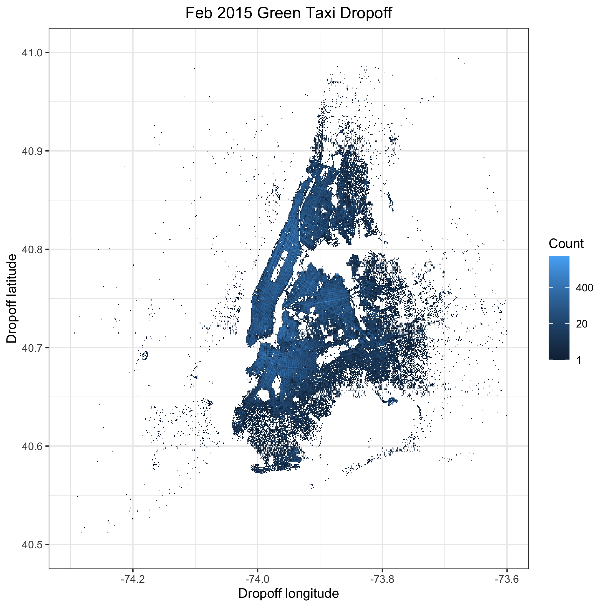
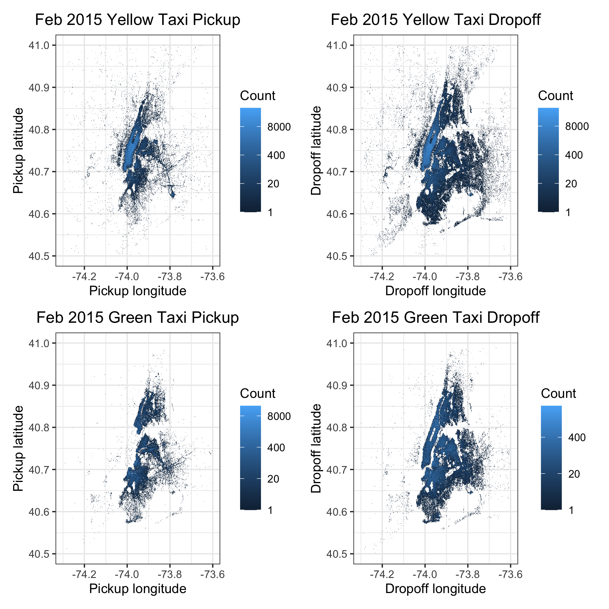
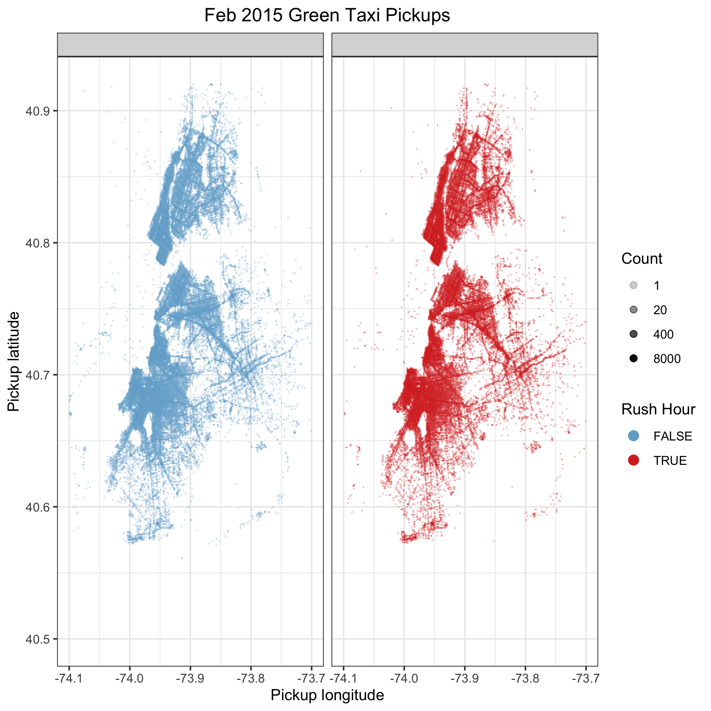

```{r setup, include=FALSE}
knitr::opts_chunk$set(echo = TRUE, eval = TRUE,
                      message = FALSE, warning = FALSE, comment = NA,
                      fig.width=8, fig.height=6)
```

## Task 1

In order to see the appropriate detail on each plot, we present all four of
them separately. Then, at the end, we should a 2x2 combination plot that allows
for easier comparision between the four plots.

#### Individual plots




#### Combintation plot



Observations based on February 2015 yellow and green taxi data:

- The quantity of rides is much larger for yellow taxis than for green taxis.
We can observe this phenomenon both in these plots and in the number of rows 
contained in the csv files
- Hot spots for dropoffs appear to be roughly the same between yellow and green
taxis. However, for pickups, there is a hotspot for yellow taxis (around
longitude = -74.0 and latitude 40.75), where green taxis don't appear to
be making pickups. It would be interesting to know whether green taxis are
prohibited from making pickups around that location
- For both yellow and green taxis, dropoffs span a large space than pickups, 
suggesting that they are less concentrated. This result makes intuitive sense 
because the center of Manhattan has an extremely high density of people
(so there are some very common pickup locations). In contrast, though there are
clearly most popular dropoff locations, the total set of locations is far more
diverse than we see for pickup locations.
- NOTE: All of these observations are based on plots filtered for longitude
and latitude values associated with NYC borough boundaries. This filtering
excludes some of the data contained in the original CSV files, and we accept
this trade-off for better visibility into our region of interest

## Task 2





Observations based on yellow and green taxi data during rush hours:

- Manhattan area seems to be dominated by yellow taxis--yellow taxis have a very
high concentration of pickups in that area where green taxis hardly have any.
- Green taxis have more pick ups in the upper and lower boroughs of NYC than
yellow taxis, both during rush hours and outside of rush hours.
- The non-rush hour pickups are densier than rush-hour pickups for both taxis
which makes sense because the rush-hour periods are much shorter, so naturally 
there would be more pickups during the non-rush hours.

