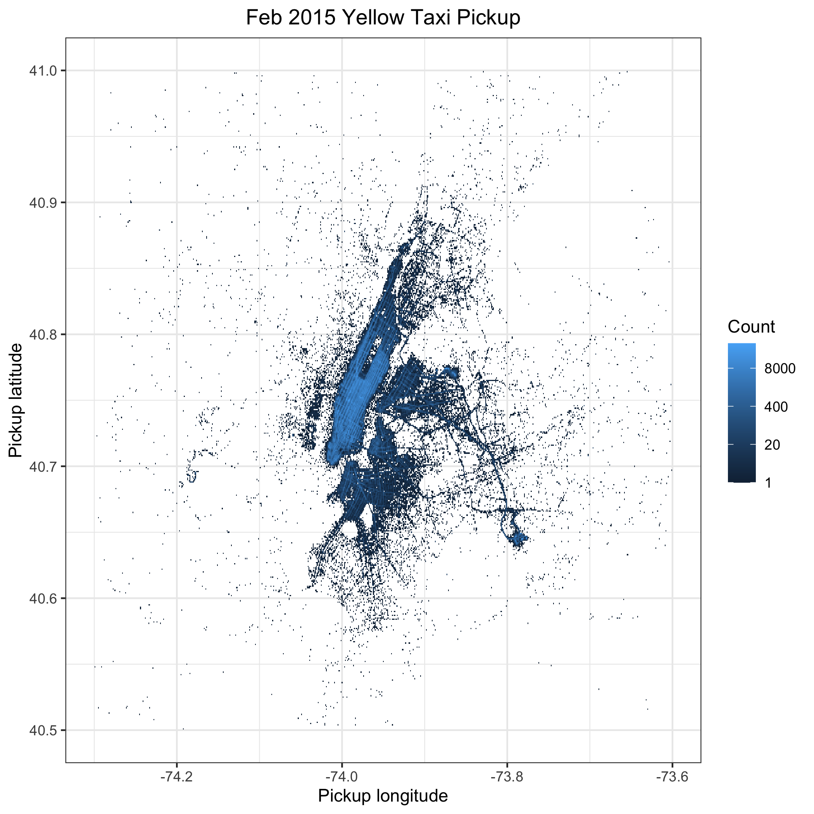
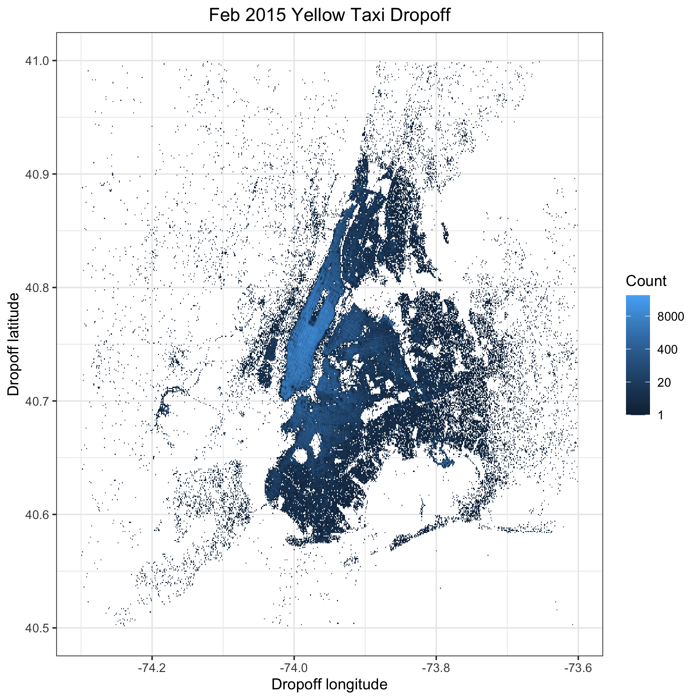

# NYC taxi data visualization

## Description

In this repository, we explore February 2015 NYC yellow and green 
taxi data from the NYC Taxi & Limousine Commission 
[website](https://www1.nyc.gov/site/tlc/about/tlc-trip-record-data.page).
Specifically, we are interested in generating (4) heatmaps that depict drop-offs
and pick-ups for yellow and green taxis in the chosen month. Please note
that the chosen month (Feb 2015) has no special significance and is
effectively chosen at random to demonstrate the following competencies:

- Webscrapping (through use of Google Chrome Developer tools)
- Manipulation of large data sets using Spark. Here, we simply
create a local instance of Spark using `sparklyr`
- A reproducible, multi-step research process using a Makefile

## Plot showcase

### Yellow taxis

### Green taxis

### Side-by-side comparison

## Acknowledgements

This project was completed as part of STA 523 (Statistical Programming) at Duke,
taught by Professor Shawn Santo. Code in this repository was co-written
with a classmate, Yue Han, and two other classmates, Marc Brooks 
and Cathy Shi, provided valuable problem-solving support.
